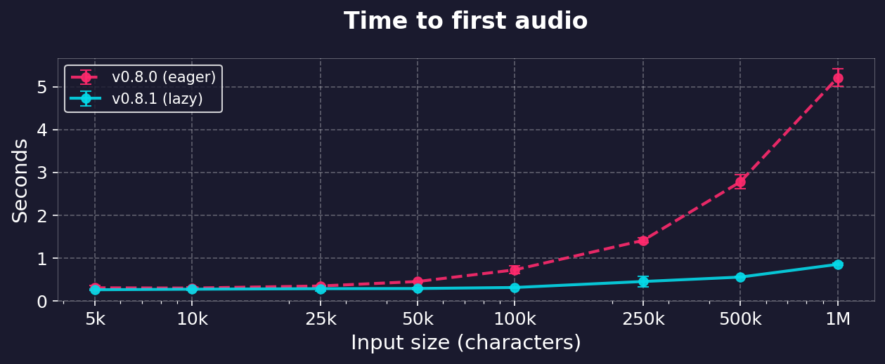

# smart_split: lazy phonemization

Notes on why time to first audio scaled with request size, what changed, and what it costs.

Branch: `opt/smart-split-handling`. Baseline: `5123702`.

## Symptom

`smart_split` is an async generator, so the expectation is that a long request starts
producing audio as soon as the first chunk is ready. It did not. On an 840k character
input, 91% of the split ran before the first chunk was yielded:

```
chars=840140  chunks=3571  first_chunk=2.83s  total=3.12s
```

Time to first chunk grew linearly with input length, and since `generate_audio_stream`
consumes `smart_split` with `async for`, that delay landed directly in time to first audio
byte on the streaming endpoints.

## Cause

`api/src/services/text_processing/text_processor.py`

`smart_split` splits the raw text on pause tags into parts (`:218`), then for each part:

1. normalizes the whole part (`:239`),
2. calls `get_sentence_info(processed_text)` (`:250`),
3. loops over the result, accumulating sentences into chunks and yielding them.

`get_sentence_info` was a plain function returning a list. It phonemized and tokenized every
sentence in the part via `process_text_chunk` before returning, so step 3 could not start
until all of step 2 had finished. With no pause tags in the text, the whole input is one
part, so the eager unit is the entire request.

The generator shape was real; the work behind it was not incremental.

## Change

`get_sentence_info` yields instead of accumulating:

```diff
 def get_sentence_info(
     text: str, lang_code: str = "a"
-) -> List[Tuple[str, List[int], int]]:
-    """Process all sentences and return info"""
+) -> Iterator[Tuple[str, List[int], int]]:
+    """Yield (sentence, tokens, token_count) per sentence, phonemizing lazily."""
     ...
-    results = []
     for i in range(0, len(sentences), 2):
         ...
         tokens = process_text_chunk(full)
-        results.append((full, tokens, len(tokens)))
-    return results
+        yield full, tokens, len(tokens)
```

Plus the `Iterator` import, and `list(...)` around the two test call sites that index the
result. `smart_split` already consumed it with a plain `for` loop and never re-read or
measured it, so nothing there needed to change.

Callers: `smart_split` (`:250`), `test_get_sentence_info`, `test_get_sentence_info_chinese`.
No other consumer in the repo.

## Measurements

All numbers from the running GPU compose container (`kokoro-fastapi-gpu-kokoro-tts-1`,
python 3.12, phonemizer espeak backend), which hot-mounts `api/`. A and B runs interleaved
via `git stash` / `git stash pop` in the same loop, so machine drift cannot separate them.
Loguru output disabled in the harness unless noted.

Corpus: `287.txt` is the 4940 character attachment from issue #287. `mid10` and `mid40` are
its first 49k and 198k characters repeated; `big.txt` is 170 copies (840140 chars).

### Time to first chunk vs total

| chars | chunks | base first | lazy first | base total | lazy total |
|---|---|---|---|---|---|
| 4,940 | 22 | 0.04s | 0.02s | 0.04s | 0.03s |
| 49,400 | 210 | 0.28s | 0.05s | 0.29s | 0.23s |
| 197,600 | 839 | 0.72s | 0.13s | 0.77s | 0.97s |
| 840,140 | 3,571 | 2.80s | 0.53s | 3.05s | 3.92s |

Repeatability at 840k, three interleaved pairs, logging on:

```
base  first=2.89s total=3.21s     lazy  first=0.51s total=4.10s
base  first=2.91s total=3.22s     lazy  first=0.52s total=3.91s
base  first=2.80s total=3.14s     lazy  first=0.52s total=4.05s
```

Time to first chunk is now roughly flat in input size. Below ~100k characters the change is
a straight win on both metrics.

### End to end, through the HTTP API

The table above is the splitter in isolation. Measured through the server instead, time to
the first audio byte on `/v1/audio/speech` with `stream: true` and `response_format: pcm`,
the stream dropped once the first chunk lands:

| tokens (cl100k) | base | lazy |
|---|---|---|
| 500 | 0.314s ± 0.034 | 0.270s ± 0.042 |
| 1,000 | 0.284s ± 0.020 | 0.282s ± 0.014 |
| 2,500 | 0.315s ± 0.020 | 0.310s ± 0.097 |
| 5,000 | 0.439s ± 0.079 | 0.285s ± 0.039 |
| 10,000 | 0.537s ± 0.038 | 0.300s ± 0.046 |
| 25,000 | 0.994s ± 0.092 | 0.323s ± 0.016 |
| 50,000 | 1.793s ± 0.036 | 0.408s ± 0.023 |
| 100,000 | 3.405s ± 0.044 | 0.551s ± 0.029 |



n=5 per point, ± is 1 SD. Each tree captured under the same protocol: restart the container,
wait for `/health`, five warmup requests, then sweep, with a 3s settle between requests.
The settle matters. Dropping the stream stops the server one chunk late, so back to back
samples each carry the tail of the request before them and the whole curve floats up by
~0.5s.

The curves separate from about 5k tokens. Below that both sit on the same ~0.27s floor,
which is first-chunk inference, not the splitter. Above it, base grows roughly linearly
with input while lazy climbs gently; at 100k tokens the gap is 2.9s, a factor of 6.2.

Lazy is not flat: 0.27s to 0.55s across the sweep. That residual is `normalize_text`, which
still runs over the whole input before the generator yields its first sentence.

Harness: `examples/assorted_checks/benchmarks/benchmark_first_token_lazy_ab.py`, captured
per tree with `--label base` / `--label lazy` and rendered with `--plot`.

### Where the remaining 0.5s goes

Component timings on `big.txt`:

```
normalize=0.49s
iterate_all=2.33s   sentences=15130
list_all=2.32s
```

The 0.53s prefix is `normalize_text` over the whole part, which is regex only and still
eager. `iterate_all` vs `list_all` (2.33 vs 2.32) shows the generator itself adds no
measurable overhead when fully drained.

## The regression

Above ~100k characters, total splitter wall time is ~28% worse (3.05s to 3.92s at 840k).
This is consistent, not noise: it survives interleaved A/B, logging disabled, and
`gc.disable()`.

cProfile on `big.txt`, sorted by tottime:

| | base | lazy |
|---|---|---|
| total function calls | 4,295,439 | 4,295,439 |
| profiled wall | 4.63s | 5.77s |
| espeak `text_to_phonemes` (24,310 calls) | 1.394s | 1.754s |
| `re.Pattern.sub` | 0.679s | 0.712s |
| `_postprocess_line` | 0.187s | 0.247s |
| `_preserve_line` | 0.247s | 0.194s |
| loguru `_log` (cumtime) | 0.381s | 0.567s |

Identical call counts. Same functions, same number of times, uniformly slower per call,
including C level and ctypes calls that the change does not touch. So it is not extra work.

Ruled out:

- **Generator overhead.** `list_all` and `iterate_all` are within 0.01s of each other.
- **GC pressure.** `gc.disable()` in the harness: base 3.05s, lazy 3.94s. Unchanged.
- **Logging interleave.** `logger.remove()`: base 3.06s, lazy 3.95s. Unchanged.

Best remaining explanation is cache locality. The baseline runs 15,130 espeak calls back to
back, then does pure Python chunk assembly. The lazy version alternates between the two
working sets on every sentence, so espeak's buffers and the phonemizer's regex machinery get
evicted between calls. That matches the shape of the evidence: a uniform per-call tax across
unrelated hot functions with no change in what is executed.

Not proven to that level of detail, and not worth the instrumentation to prove, because the
tradeoff does not turn on the mechanism.

## Tradeoff

Take the regression.

- 840k characters is on the order of 15 hours of audio. Inference for that request runs for
  many minutes; 0.9s of extra splitter CPU spread across it is not observable.
- Time to first audio is the metric a streaming endpoint exists to serve, and it improved
  5.3x at 840k, 5.6x at 49k.
- Under ~100k characters, which covers essentially all real requests, lazy is faster on both
  wall time and time to first chunk.
- The cost is CPU on the event loop thread, additive with inference rather than hidden behind
  it, which is why it is worth naming rather than waving off. It is still small against the
  synthesis it precedes.

## Implications

### Output is unchanged

The chunk stream is byte identical. sha256 over every `(chunk_text, tokens, pause)` tuple
in order, base vs lazy:

| chars | chunks | base | lazy |
|---|---|---|---|
| 4,940 | 22 | `dff95dc11cefe0a1068b5d93b20fab25` | same |
| 197,600 | 839 | `6fb9a4a6e0ac6c159c8f236799e4012d` | same |
| 840,140 | 3,571 | `bea99c69482dae4bd173d9c1dd7471a7` | same |

Expected, since the consumer loop reads the same tuples in the same order, but worth
pinning: chunk boundaries drive both audio segmentation and `/dev/captioned_speech`
timestamps.

### Feature matrix, splitter level

Hash over the full `(chunk_text, tokens, pause)` stream, base vs lazy, mirroring how
`tts_service` drives it (`split_by_voice` first, then `smart_split` per segment). All
13 identical:

```
plain  pause  custom_ph  chinese  british  no_norm  norm_on
long_sent  unicode  tiny  one_word  voice_tags  ssml_like
```

`long_sent` matters because it exercises the `count > max_tokens` branch, where
`smart_split` splits on commas and calls `process_text_chunk` itself rather than going
through `get_sentence_info`. That path is untouched and confirmed unchanged.

### Feature matrix, end to end

Run against a scratch container on 8881 (same image, working tree mounted), once with the
change and once reverted, restarting between. Oracle is the per-chunk text from the
`return_timing` JSON sidecar, which is the splitter's own output carried through the full
router path, plus the word sequence from `/dev/captioned_speech`:

| case | chunks | base | lazy |
|---|---|---|---|
| plain / wav / opus / speed 1.3 / mixed voice / british | 12 | `b67597f722e1f76e63fe0697` | same |
| voice tags (3 speakers + rate) | 4 | `562f68d790059c02a0796089` | same |
| pause tags | 5 | `e552ff6eb7e4c5992bc71fba` | same |
| custom phonemes | 1 | `4400d73052e25e6cf054de73` | same |
| normalize off | 12 | `72ca617a59a3b99cb1ea3c0f` | same |
| captioned_speech word sequence | 444 words | `5017647eef032460b6940e26` | same |

Zero errors, tracebacks, or exceptions in the container log across both passes.

Note on method: comparing raw audio bytes does not work as an oracle. Two consecutive runs
of the identical build produce different bytes (mp3 sizes match but hashes differ; wav
lengths drift by ~160 bytes), so GPU inference is not bit reproducible here independently of
this change. Chunk text is deterministic and is the thing the splitter actually controls.

### Formats and streaming mode

`response_format` never reaches the splitter. `smart_split` emits text and token ids;
`StreamingAudioWriter` encodes downstream of it. Identical chunk stream means identical
encoder input, so mp3, wav, opus, flac, pcm, and aac are all unaffected, confirmed 200 with
identical chunking above.

Non-streaming (`stream: false`) is likewise unaffected, and is also immune to the failure
timing change below: `generate_audio` (`tts_service.py:514`) drains the whole generator into
one buffer before the router constructs `Response(...)`, so an exception anywhere in the
split still produces a clean error status with no partial body.

### Transcription roundtrip, 9 languages

The chunk-text oracle proves the splitter emits the same text. It says nothing about whether
the resulting audio is still intelligible, and the end-to-end matrix above is English only.
The repo's own `tts-api-test-client` image covers exactly that gap: faster-whisper with
Whisper small CT2 weights baked in, driving
`api/tests/integration/test_tts_roundtrip.py`, which synthesizes one sentence per language
and transcribes it back against WER/CER thresholds.

Run against the GPU server on both trees, restarting between passes: 17/17 passed each time,
identical transcripts and identical scores on every case, including `jf_alpha-ja`
(CER 0.000) and `zf_xiaobei-zh` (CER 0.143).

That suite alone does not exercise this change, though. Every case is a single sentence, so
the modified loop runs once and never yields twice. A multi-sentence pass (8 English
sentences, 5 Chinese) covers the real shape:

| case | base | lazy |
|---|---|---|
| af_heart/en | WER 0.016, 21.29s, 1022032 B | WER 0.016, 21.29s, 1022034 B |
| bf_emma/en | WER 0.016, 19.48s, 934894 B | WER 0.016, 19.48s, 934890 B |
| zf_xiaobei/zh | CER 0.159, 11.50s, 552194 B | CER 0.159, 11.50s, 552214 B |

English transcripts are byte-identical. Duration matches to 0.01s in all three, which is the
signal that matters: same chunk boundaries, same total audio, nothing dropped or reordered.
Byte counts drift 2 to 20 bytes, consistent with the GPU nondeterminism measured on identical
code. The Chinese transcripts differ only in punctuation Whisper chose to insert
(`吧 那裡` against `吧! 那裡`); character content is identical, which is why CER lands on the
same 0.159 both ways.

This is the first check to put actual audio through the Chinese branch of
`get_sentence_info` (`re.split(r"([，。！？；])+", text)`).

### Peak memory drops

`tracemalloc` peak over the full split:

| chars | base | lazy |
|---|---|---|
| 4,940 | 0.3MB | 0.3MB |
| 197,600 | 4.1MB | 1.2MB |
| 840,140 | 18.4MB | 6.6MB |

The eager version held all 15,130 `(sentence, tokens, count)` tuples for the part alive at
once. Small in absolute terms, but it is per concurrent request, and oversized requests
exhausting memory is what `MAX_INPUT_LENGTH` was added for (#511).

### API surface

`get_sentence_info` is not in `text_processing/__init__.py` `__all__`, so it is internal.
One production caller (`smart_split`), two test call sites. `smart_split` itself is
unchanged in signature and behavior, so its callers (`tts_service.py:300`,
`routers/development.py:17`, `test_pause_bounds.py`) are untouched.

### The tokens are never synthesized

Worth stating early because it bounds several claims below: the token lists
`get_sentence_info` produces never reach the model.

`_process_chunk` (`tts_service.py:54`) hands `chunk_text` and `lang_code` to
`model_manager.generate`, and `KPipeline` (`kokoro_v1.py:167`) runs its own G2P with the
correct language. `tokens` is used for exactly three things: `len(tokens)` for chunk sizing
against the 175/250/450 targets, the `if not tokens and not chunk_text` empty check, and the
legacy-backend branch at `tts_service.py:139`. That branch is dead. `ModelManager` sets
`self._backend = KokoroV1()` unconditionally (`model_manager.py:42`).

Two consequences, both pre-existing and independent of this change:

- Every sentence is phonemized twice, once by espeak in the splitter and thrown away, once
  by KPipeline for real. The work this change makes lazy is discarded work.
- `process_text_chunk(full)` is called with no `language` argument at `:122` and `:284`, so
  chunk sizing always measures en-us espeak phonemes regardless of `lang_code`. For `b` that
  is close enough. For `z`, `j`, `h` and the rest, the token counts driving the 175/250/450
  window describe a phoneme stream the model never sees. `absolute_max_tokens` is the guard
  against KPipeline's 510-token ceiling, so a bad estimate there is worth its own look.

This is also why the non-English transcription roundtrips pass: audio correctness never
depended on the splitter's phonemes.

### Failure timing (narrower than it first looks)

Exceptions from phonemization surface later in principle. Traced call by call, no reachable
input actually behaves differently:

- `tokenize` cannot raise. `[i for i in map(VOCAB.get, phonemes) if i is not None]` drops
  unknown phonemes silently, so there is no content-dependent per-sentence failure.
- `create_phonemizer`'s `ValueError` fires only on first use per language, and the backend is
  cached in the module-level `phonemizers` dict, so it can only ever hit the first sentence.
  #511 also validates `lang_code` up front at the router.
- Both splitter call sites pass no `language` at all, so it is always `"a"` and that branch
  cannot fire from here regardless (see above).
- What remains is espeak dying mid-request, which is process level rather than sentence
  specific, and which could already strike mid-stream on the eager version, since that pass
  ran inside the same generator.

Errors on the first sentence are unaffected either way: `smart_split` cannot yield a chunk
before at least one sentence is phonemized. Normalization, `MAX_INPUT_LENGTH`, and
`check_pause_budget` all still run before the first chunk, so request-level rejections are
unchanged.

Should a per-sentence raise become reachable later, the difference is that it would arrive
after `200 OK` and some audio, giving a truncated stream rather than an error status.
Streaming responses only; the non-streaming path buffers the whole result before responding.

### Event loop occupancy

Not measured, structural: the splitter never awaits, so it blocks the loop thread either
way. What changes is the shape. An 840k request used to hold the loop for one contiguous
2.8s stretch before the first chunk; the same work is now ~15,130 sub-millisecond stretches
interleaved with inference, which does have suspension points per chunk. On a single
worker, that is the difference between a long request freezing every other client for 2.8s
and it not doing so (#115, #358).

### Single-use result

A generator cannot be re-iterated or `len()`d. The one call site iterates once. Anything
later that needs the full sentence list must wrap it in `list(...)`, which restores the old
latency profile, so the smart_split test below guards the call site as well as the function.

## Verification

Full `api/tests` suite via `uv run --no-sync python -m pytest api/tests -q`.

Two regression tests added, both of which fail if the change is reverted:

- `test_get_sentence_info_is_lazy` stubs `process_text_chunk` with a counter and asserts
  nothing is phonemized at call time, one sentence after the first `next()`, two after the
  second. On revert: `assert ['One.', 'Two.', 'Three.'] == []`.
- `test_smart_split_first_chunk_skips_rest_of_text` pulls a single chunk from a 200 sentence
  input and asserts fewer than 10 sentences were phonemized. This is the property that
  matters (time to first chunk) and it also catches a future `list(...)` at the call site.
  On revert: `assert 200 < 10`.

The two pre-existing `get_sentence_info` tests now materialize with `list(...)`; their
assertions are unchanged.

## Still eager, not addressed

Per pause-delimited part, before the first yield:

- `PAUSE_TAG_PATTERN.split` over the raw request text.
- `normalize_text` over the whole part (the measured 0.49s at 840k).
- `CUSTOM_PHONEMES.split` and the rejoin around it.
- `re.split` into sentences (string work only, no phonemization).

Pause tags subdivide the eager unit, so a request with `[pause:Ns]` tags already had a
shorter prefix than one without.

## Possible follow-ups

- `smart_split` logs `logger.info` per chunk. At 3,571 chunks that is 18,704 loguru `_log`
  calls and 0.4 to 0.6s of cumtime on a single request. These read like debug lines.
- Streaming `normalize_text` sentence by sentence would flatten the last of the prefix, at
  the cost of normalization losing cross-sentence context.
- Batching espeak calls would recover the throughput lost above, and would likely beat both
  versions, but it is a real change to the phonemization path rather than a four line diff.
- The splitter's espeak pass is discarded work (see "The tokens are never synthesized").
  Sizing chunks by a cheap proxy, or by KPipeline's own G2P, would remove it outright and
  fix the non-English sizing at the same time. Bigger than this branch: it moves chunk
  boundaries, so it changes audio.
- `api/tests/integration/` has no multi-sentence case. Every roundtrip is one sentence,
  which is not the shape of any real request and does not cover chunk assembly at all.
