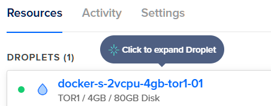
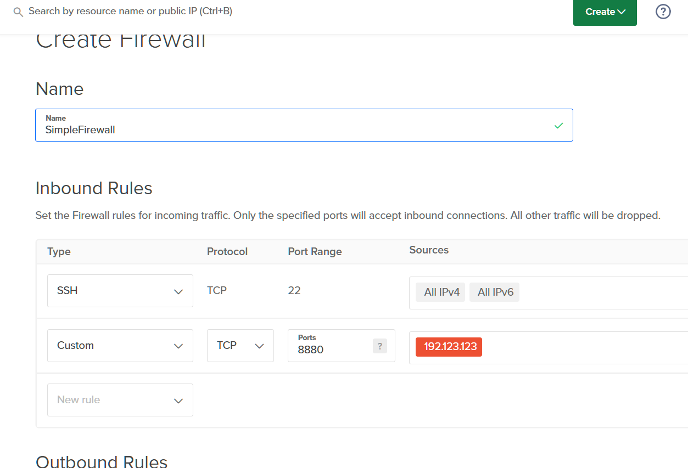

# Quick Guide: Running kokoro-fastapi on DigitalOcean

*Last updated: 2025-02-13*

> [!CAUTION]
> There's no security on the API itself with this guide; anybody who knows the droplet IP, will be able to access the interface and API freely unless you add additional security.


This guide will help you deploy and run the kokoro-fastapi Docker container on a DigitalOcean Droplet. 

Replace the placeholder values (e.g., `YOUR_USERNAME`, `YOUR_DROPLET_IP`) with your actual account and instance details.

---

## 1. Set Up Your DigitalOcean Account & Droplet

- **Sign Up / Log In:**  
  Create or log into your [DigitalOcean account](https://www.digitalocean.com/)

- **Create a Droplet:**  
  Use the DigitalOcean dashboard to create a new Droplet.  
  - Choose the [Docker Droplet](https://marketplace.digitalocean.com/apps/docker) image to have Docker and Docker Compose pre-installed, on Ubuntu.  
  - Choose resources with at least 4gb of memory (may be able to get away with 2gb with some optimizing, but I haven't tested it)

Here's the version I used.
<p align="center">
  
</p>


## 2. SSH into Your Droplet

Set up an SSH key if you haven't already: [DigitalOcean SSH guide](https://docs.digitalocean.com/products/droplets/how-to/add-ssh-keys/).

Once your Droplet is set up, note its public IP address (for example, `YOUR_DROPLET_IP`). Use SSH to connect:

```bash
ssh root@YOUR_DROPLET_IP
```
- **Note:** If this is your first time connecting, you'll be asked to confirm the host's authenticity. Type `yes` to continue.
---

## 4. Run the kokoro-fastapi Docker Container

As Docker is pre-installed, run the following command on your Droplet (within the ssh connection) and you're in:

```bash
docker run -p 8880:8880 ghcr.io/remsky/kokoro-fastapi-cpu:latest
```

This command will:
- Pull the image from GitHub Container Registry if it isn’t already available locally.
- Map port `8880` from the container to port `8880` on the Droplet.
---

## 5. Access the Web Interface
Once the container is running, the logs will indicate that the web player is available. 

Ignore the printed IP address. Open your browser and navigate to:
```
http://YOUR_DROPLET_IP:8880/web/
```
You should now see the kokoro-fastapi web interface.
---

---

## 6. DigitalOcean Firewall  

By default, **anyone who knows your Droplet's public IP** can freely access the interface and API. To enhance security, consider restricting access using DigitalOcean’s firewall settings.  

You can allow-list only specific IPs (such as your own) to limit exposure. However, ensure that this method aligns with your security needs, as relying solely on it **may not be sufficient** for full protection.  

### **Find Your Public IP**  
Run the following command to get your IP address:  

```bash
curl -s https://checkip.amazonaws.com
# Example output: 192.123.123.123
```

Use this IP to configure DigitalOcean’s firewall settings.

<p align="center">
  
</p>

Be sure to **review and verify your security settings** before relying on this method.