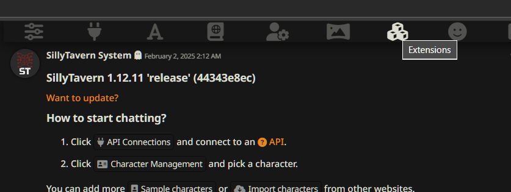
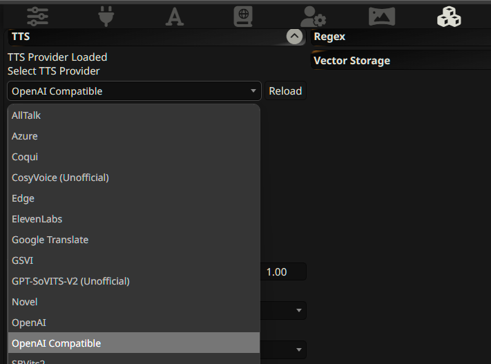
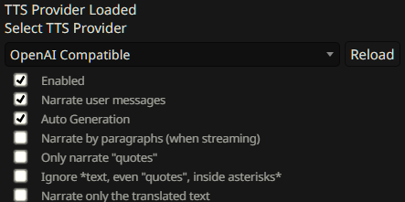
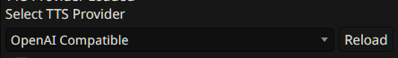
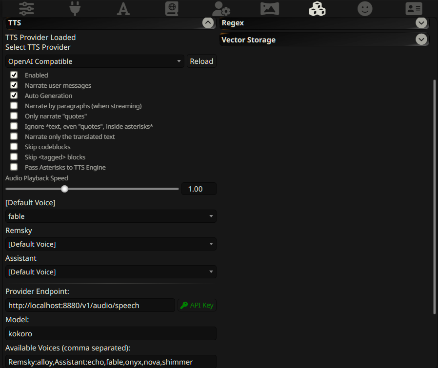
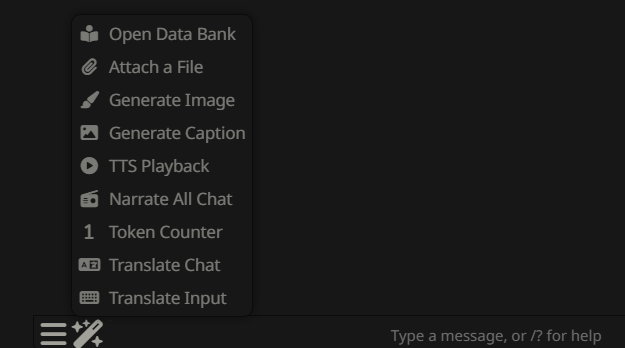

# SillyTavern Integration Guide

*Last updated: 2025-02-02*

Once you have the API running, the base url will depend on whether you are running SillyTavern itself from Docker, or directly (if you used their installer, it's likely running directly). 

## Setup Instructions

1. Go to the `Extensions` menu in the top bar of SillyTavern. 

   

2. Find the `TTS` menu on that page and where it asks you to `Select TTS Provider`, select `OpenAI Compatible`

   

3. Click the `Enabled` box, and if you want it running automatically, `Narrate user messages` and/or `Auto Generation`, etc. 

   

4. Fill in the provider endpoints:
   - If running directly: `http://localhost:8880/v1/audio/speech`
   - If running in Docker: `http://host.docker.internal:8880/v1/audio/speech`

5. You may have to hit the `Reload` button (the one right next to where it says OpenAI Compatible) to have it open up the remaining settings.

   

6. Set the model as `kokoro`, the API Key as `not-needed`

7. In available voices: You can either use the known listed voices of the Kokoro model by name, or there is an auto-mapping of voices in the OpenAI (SillyTavern prefills these in as well). For auto-narration, you have to manually edit this line to map which character gets which voice:

   ```
   Remsky:alloy,Assistant:echo,fable,onyx,nova,shimmer
   ```

   

## Final Steps

Voila! You should now be able to go back to chat and select the option you want (e.g., "Narrate All Chat"), and it should start speaking.

